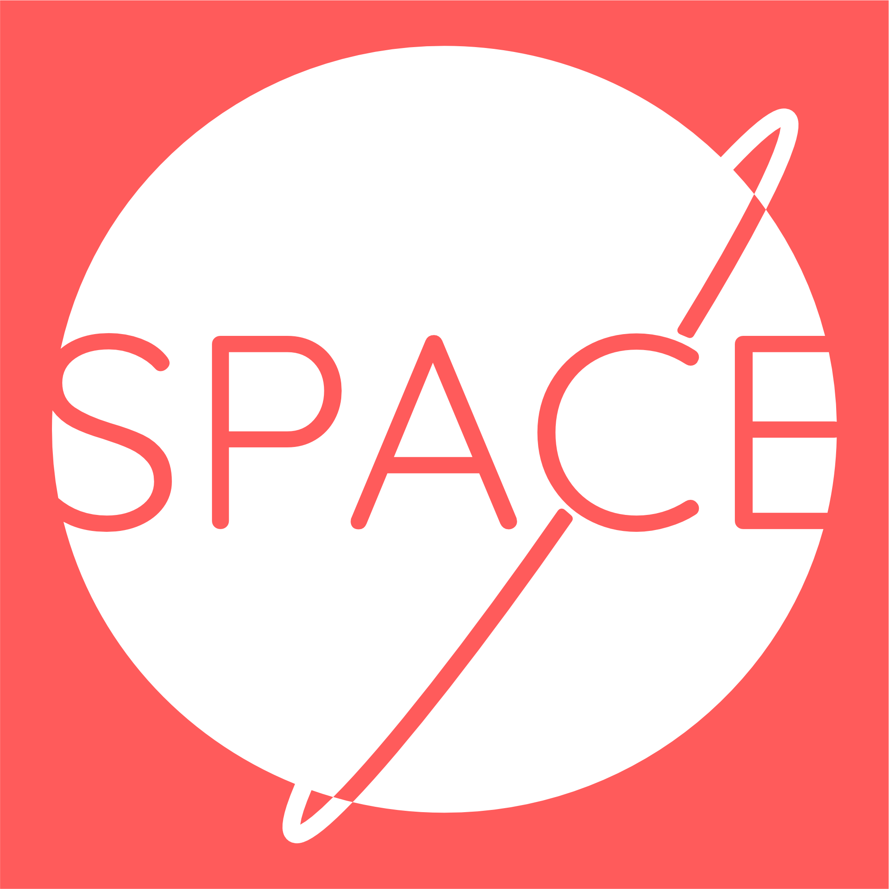

# Day 1

## Prompt

> Hey Designer!
>
> I'm Mary, the project coordinator at Space. We're so happy to have you work on our logo design! Space is building coworking offices so that freelancers and small startup companies have a stunning office to work out of without paying the big bucks to buy or lease a large building.
>
> We offer rentable offices for teams of 1 to 12 in beautiful areas across the world including Austin, New York City, Raleigh, Chicago, San Francisco, and London. These offices are also great for people working remote for larger companies.
>
> For the Space logo, we want to capture the idea of a personal, modern, and fun shared office space. We would be open to some kind of icon or using the text "Space" to represent the company. We don't have any requirements in terms of colors, text, icon, or otherwise. Have fun with some ideas!
>
> And if this helps, some of our competitors are Industrious and WeWork.
>
> Regards,
> 
> Mary Anderson
> **Space - Project Coordinator**

---

## Sketching Ideas

As I was exploring ideas for both space as in "the final frontier" and office spaces. So you can see in the different explorations some office chairs, office tables with chairs, but also some rockets and space ships. After some searching and referring to the competitors logos that were mentioned in the brief, I determined that the ideas I had for office chairs and office space would not get the look I was going for. 

I decided to continue to explore the bottom right sketch, the planet, with the word space and having the 'C' be a moon with an orbit around the planet. I knew I would need to find a font where the 'C' was very circular and I wanted the planet to be in tighter, so I just started continuing on with that.

So this was a cleaned up version and the final version that I did in Procreate, I now had a basic idea of what I wanted to do and all that was left was to bring this into Affinity Designer and finalize the logo.

---

# Font

Because I have the word being a vital part of the logo, I wanted to get the font nailed down first. In order to find a royalty free font, I went ahead to [fontsquirrel.com](https://www.fontsquirrel.com) and searched for a font that looked clean and modern while at the same time had a circular capital 'C' since that was the most important part to the logo. I ended up finding and proceeding with [Quicksand](https://www.fontsquirrel.com/fonts/quicksand).

Quicksand is clean and modern, the 'C' isn't a perfect circle but it is close enough for what I wanted to use it for.

---

# Final logo

After getting the idea and the font down, the last thing was just to bring it all together which ended up giving me the following final logo.

---

# Other Branding

---

< [My personal introduction to the challenge](/design/thirty-logos-challenge/intro) || 
[Day 2: Grind](/design/thirty-logos-challenge/day-2) >