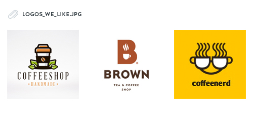
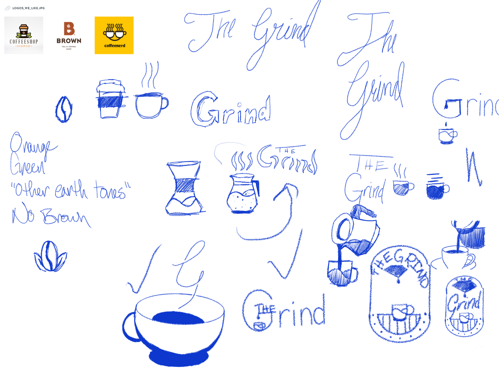
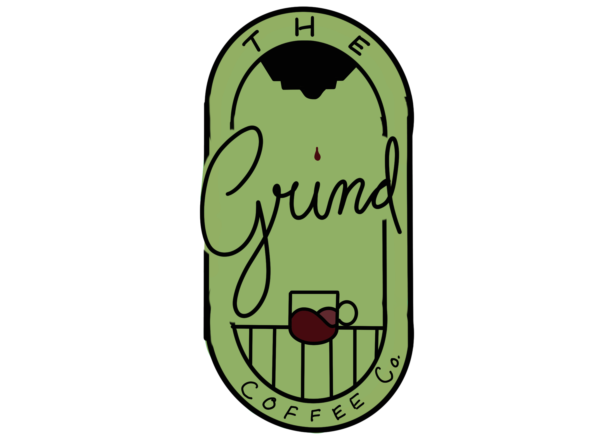

# Day 2

## Prompt

> Hi there,
>
> We're a small coffee shop chain located in Seattle, WA with five locations. Our current logo is just text using a default font but now it's time for an update!
>
> The Grind prides itself on natural and local ingredients. For our new logo, we actually do not want to use any browns! So many coffee shops around here use brown and we'd like to stand out. Maybe oranges, green, other earth tones, etc. could work well.
>
> This logo will primarily be used as our store sign, on menus, and on coffee cups and merchandise. The Grind logo could be text based or have an icon, we're open to either/both. We're open to using symbols that represent coffee such as the coffee bean, plant, grounds, coffee cup, etc.!
>
> I'm attaching a few example of logos we really dig for some inspiration. We like a somewhat clean look.
>
> Thanks,
>
> Edgar Martin
> The Grind Coffee Shop

---

## Sketching Ideas

For this one I struggled to find something that I really felt good about. The only feeling I had was to have a cursive script font used for the word "Grind". Eventually, I reached the point where I had to continue to move on something, so looking at the different sketches I had, the one in the bottom right was speaking to me the most. So I decided to expand on that to the next phase of my logo design process, a cleaned up version but still done freehand in Procreate.

I was starting to feel a lot better about the logo as I made this cleaned up version. I even got to the point where I could say that I liked it. And then I got to the part where I had to pick the colors out. I tried to find an "Earthy" green as that was what the client wanted. After trying to find the right color and failing, I decided to leave it where I had it. That way I can pull what I have into Affinity Designer and work with the colors once I get it in there. The basic concept of the logo seems to be in place at least.

---

## Creating it in Affinity Designer

The more that I looked at that rough mockup from Procreate, the more I didn't like the stretched out circle for this logo. The big dark part in the top was too eye-catching as I didn't want that to be the focus. The script is what I wanted to be the focus so that is where I put my attention. I stripped everything out except for the script and started over, adding in only a few things so as not to draw too much attention from the wordmark.

---

< [Day 1: Space](/design/thirty-logos-challenge/day-1) ||