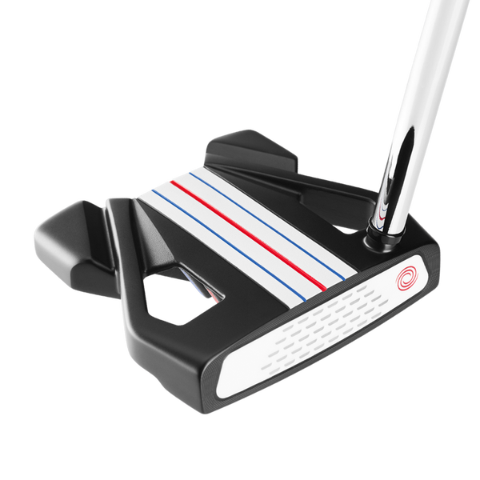
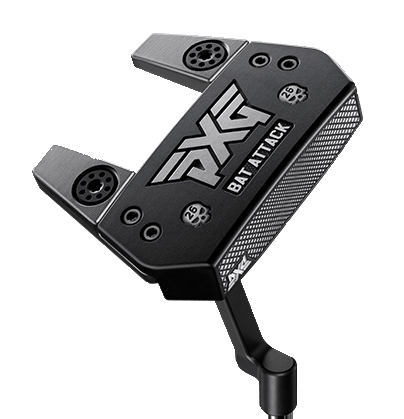
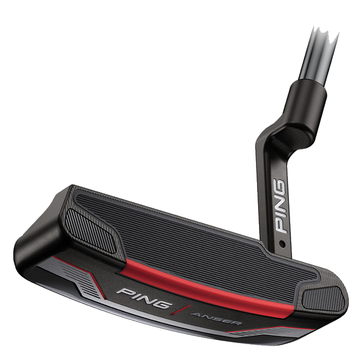
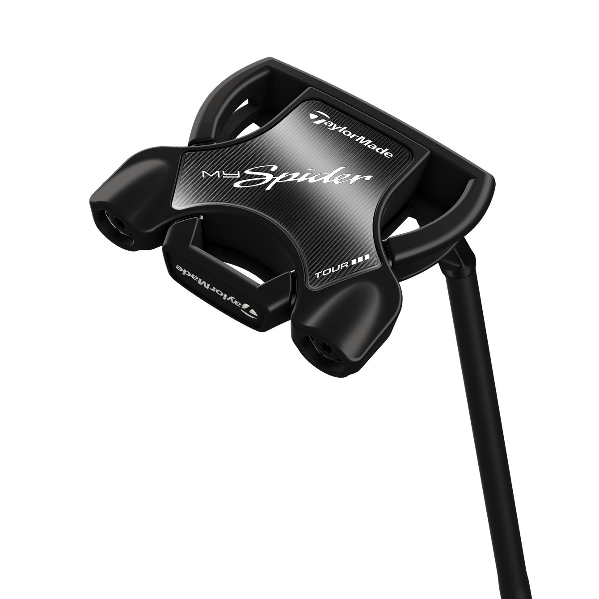
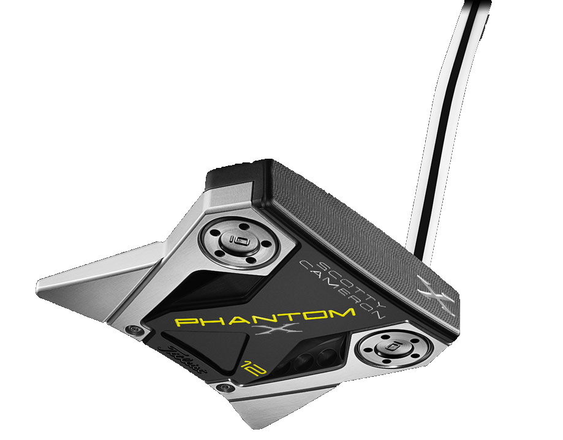
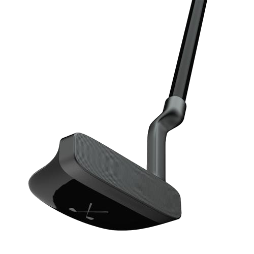

# Best Designed Putters of 2021

Being left handed and having a tight golf budget means I do not get to physically try out a lot of putters. I have my own Odyssey White Hot Pro blade putter and then the 10ish or so options at my local golf shop for lefties to try out (the place has over 300 right handed options though). That being what it is, I figured I could employ a different skill in order to rank my favorite putters of 2021, design. There are loads of reviews out there that will tell you all about the feel and weight and impact of different putters, but I focus soley on the design from a visual perspective.

This is not just the look of the putter, but also the marketing and digital design team around that. I understand that the big companies have very big and talented design and marketing teams, but there is also a lot of bad design in the golf world and I'm trying to change that. Some areas need pulled out of the 90's or older. But here are some examples that are doing it right, in no particular order.

## [Odyssey Triple Track Ten Putter](https://www.odysseygolf.com/triple-track/putters-2020-triple-track-ten.html)

I love everything about the Triple Track from Odyssey and Callaway, the purpose, the colors, the execution, all of it. Ultimately, I thing the Ten is the best looking mallet putter that Odyssey makes and combined with the Triple Track it looks amazing. This design is clearly inspired by a different mallet putter that will show up later in the list, but this also has the classic Odyssey white face. If I had an unlimited budget and I had to buy 1 putter off this list, it would be this one.

### Highlights

- Triple Track goes perfectly with the model 10 head design
- The wings in the back corners have great dynamic angles that are flat out appealing to look at
- This was on the Golf Digest Gold Hot List
- There's a long list of functionality features, like all these putters will have, go to the [website](https://www.odysseygolf.com/triple-track/putters-2020-triple-track-ten.html) or a review where someone got to physically test this for that

## [PXG Battle Ready Bat Attack](https://www.pxg.com/en-us/clubs/putters/battle-ready-bat-attack)

This is the one I admitedly have the most interaction with because it is the putter my dad uses. He is right handed, like most people, so I don't have any use experience with it, but my dad loves all of his PXG clubs and I trust his opinion on use. Design wise, this is a great looking putter.

## [Ping 2021 Anser 4](https://ping.com/en-us/clubs/putters/ping-2021)

## [TaylorMade Spider Tour](https://www.taylormadegolf.com/MySpider-Tour/DW-JIC43.html?lang=en_US&cgid=taylormade-putters-spiderfamily#lang=en_US&view=grid&start=14&)

## [Scotty Cameron Phantom X 12](https://www.scottycameron.com/putters/phantom-x/phantom-x-12/)

## [Stix Putter](https://stix.golf/products/putter)

